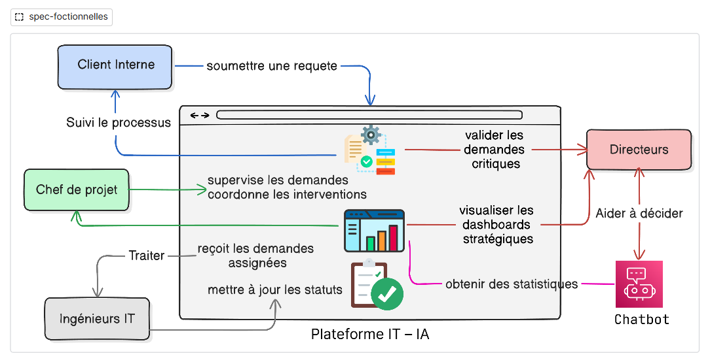
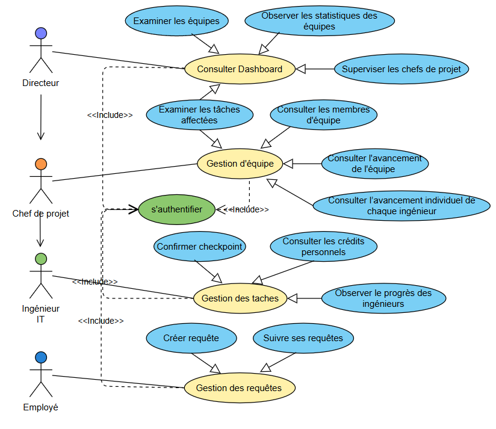
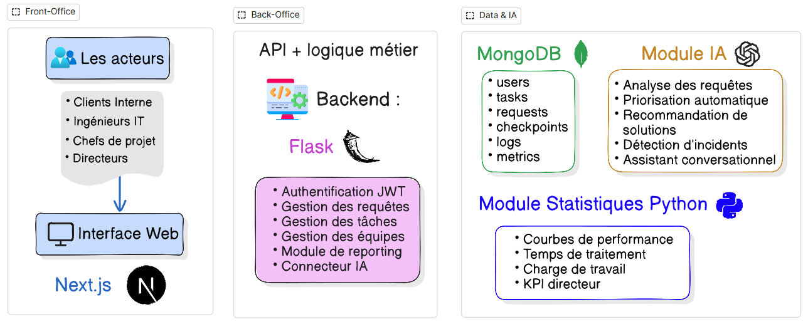
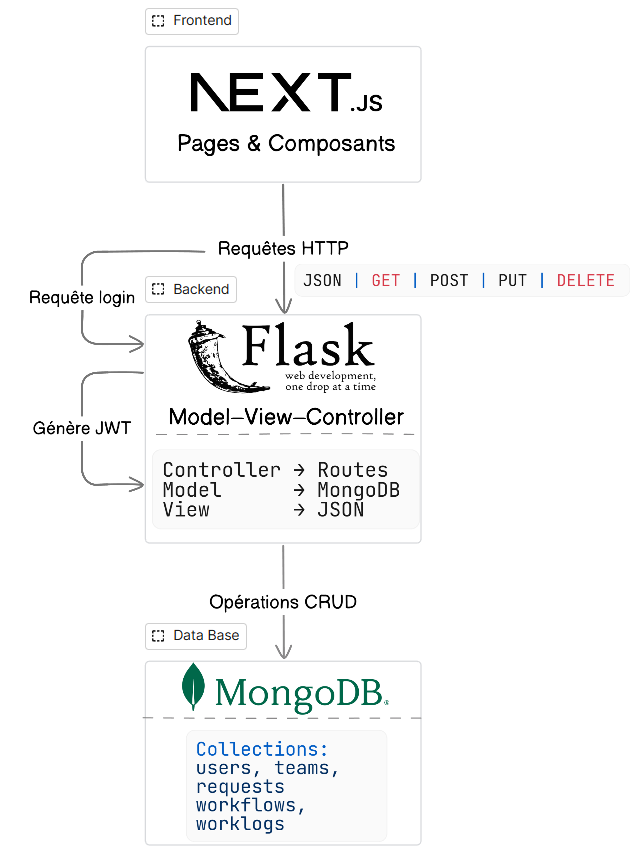
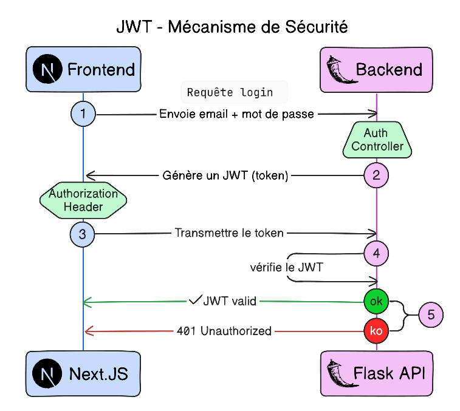
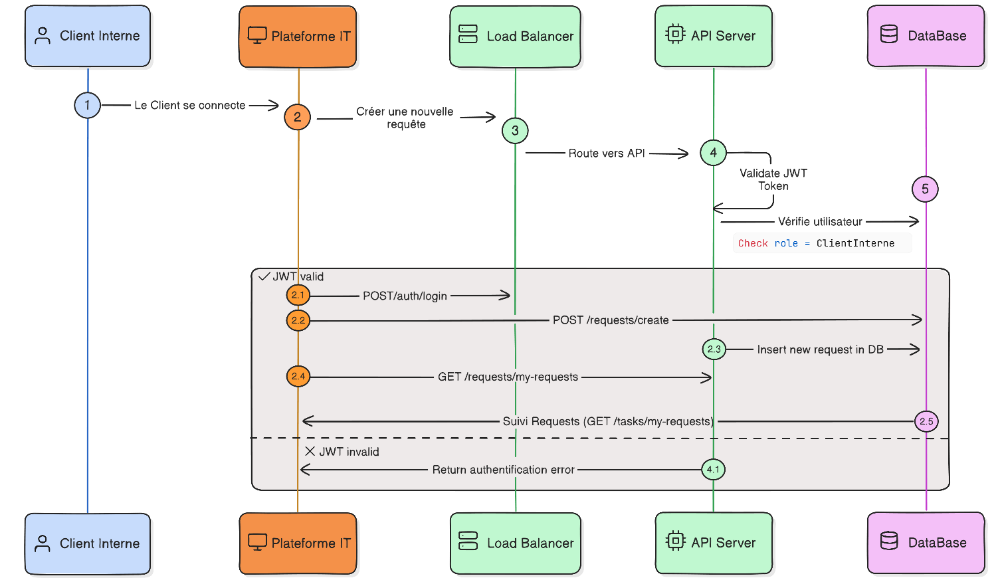
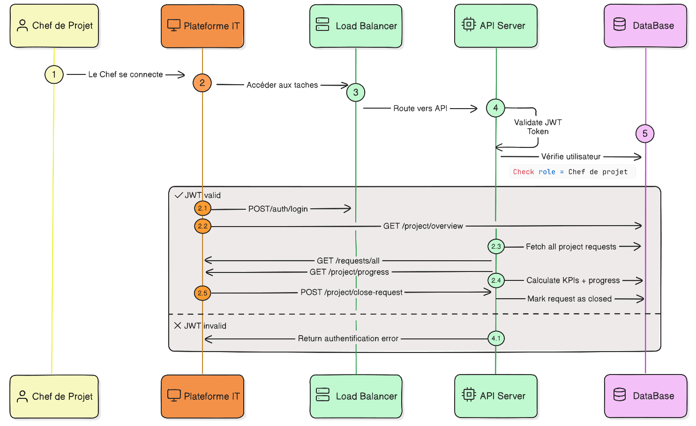
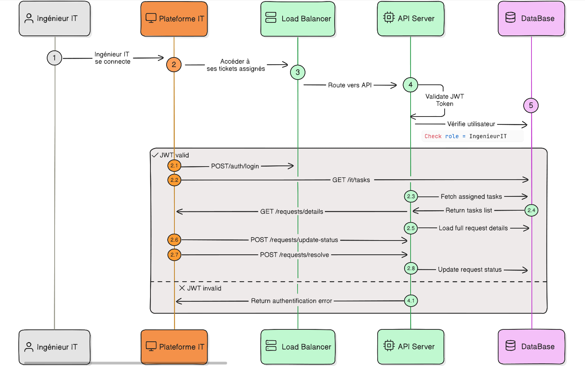
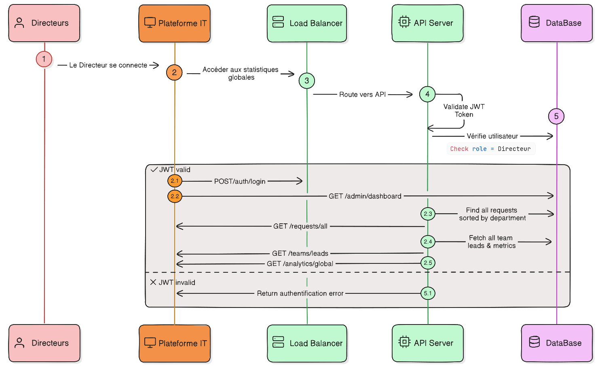

# ITSM-MVP
Plateforme intelligente de gestion, suivi et automatisation des processus IT au sein de l’entreprise.  

Dans la plupart des organisations, la communication entre les différents départements
et le service informatique repose encore sur des échanges fragmentés emails, réunions,
appels téléphoniques ou messages instantanés. Cette dispersion des canaux entraîne une
perte de traçabilité, une mauvaise priorisation des demandes, des retards de traitement
et une difficulté à mesurer la productivité réelle des équipes IT.

## Objectifs du projet
L’objectif général de la plateforme AI Management – IT System est de concevoir une
solution intelligente, centralisée et collaborative permettant d’unifier la communication
entre les différents départements de l’entreprise et le service IT. Le système vise à automatiser la gestion des demandes, améliorer la visibilité opérationnelle, faciliter la prise de décision à travers des modules d’analyse, et intégrer un agent IA capable d’assister les
directeurs.

## Spécifications Fonctionnelles
### Architecture Fonctionnelle Globale
L’architecture fonctionnelle globale de la plateforme vise à représenter l’ensemble des
interactions entre les différents acteurs du système et les fonctionnalités principales qui
composent le processus de gestion des demandes IT. Elle permet de comprendre, de manière synthétique, comment chaque utilisateur intervient dans le cycle de vie d’une requête
et comment la plateforme assure la coordination globale.

  

### Diagramme des Cas d’Utilisation
Le diagramme de cas d’utilisation permet de visualiser les différentes interactions possibles entre les acteurs et la plateforme. Il identifie les fonctionnalités principales telles
que : la création de demande, la supervision, le traitement des incidents, la validation
des requêtes critiques et la consultation des tableaux de bord. Ce diagramme constitue la
base de la modélisation fonctionnelle.

  

## Spécifications Techniques
### Vision Globale de l’Architecture Technique
Cette vue d’ensemble met en évidence la séparation des responsabilités :  
→ le frontend gère l’interaction avec l’utilisateur,  
→ le backend applique les règles métier et traite les requêtes,  
→ la base de données centralise et sécurise l’information.  

  

### Architecture Technique Détaillée
Le backend, conçu avec Flask, suit une architecture de type Model–View–Controller.  
★ Le Controller gère les routes de l’API et reçoit toutes les requêtes provenant du
frontend.  
★ Le Model communique directement avec MongoDB et réalise les opérations sur les
données.  
★ La View renvoie systématiquement des réponses structurées au format JSON.  

  

### Qu’est ce que le JWT ?
Le JWT (JSON Web Token) est un mécanisme standard d’authentification utilisé
pour sécuriser les échanges entre un client (comme une application web) et un serveur.  
Le JWT présente plusieurs avantages :  
— il est stateless, c’est-à-dire que le serveur n’a pas besoin de stocker les sessions,  
— il est léger et facile à transmettre dans les en-têtes HTTP,  
— il est sécurisé, car signé et non falsifiable,  
— il permet un contrôle d’accès rapide et efficace dans les architectures distribuées.  

### Fonctionnement du JWT dans la plateforme
Dans la plateforme, le JWT joue un rôle central dans la sécurisation des communications entre Next.js (frontend) et Flask (backend). Le processus se déroule en
plusieurs étapes, illustrées dans le schéma ci-dessous :

  

## Diagrammes de Séquence
Les diagrammes de séquence permettent de représenter dynamiquement le déroulement des interactions entre les acteurs et la plateforme. Ils illustrent, étape par étape,
l’échange de messages entre l’utilisateur, l’interface Next.js, l’API Flask et la base de
données MongoDB.  
Chaque diagramme décrit un scénario spécifique associé à un acteur particulier, comme
la création d’une demande, la supervision, le traitement ou la validation. Ces diagrammes
permettent de visualiser clairement le comportement du système et la structure logique
des échanges.

### Client Interne

  

### Chef de Projet

  

### Ingénieur IT

  

### Directeur IT

  

